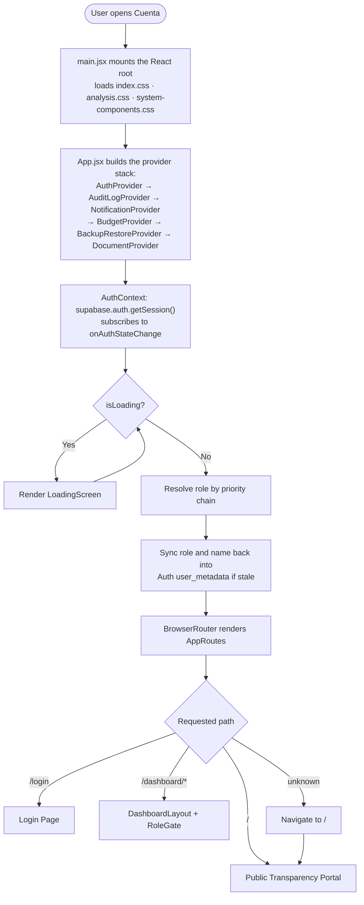
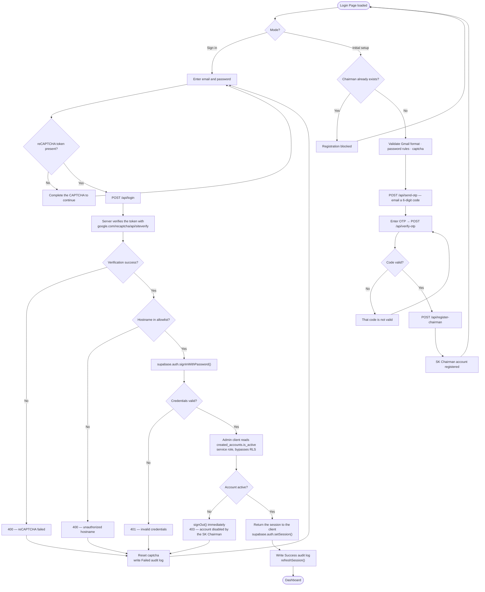
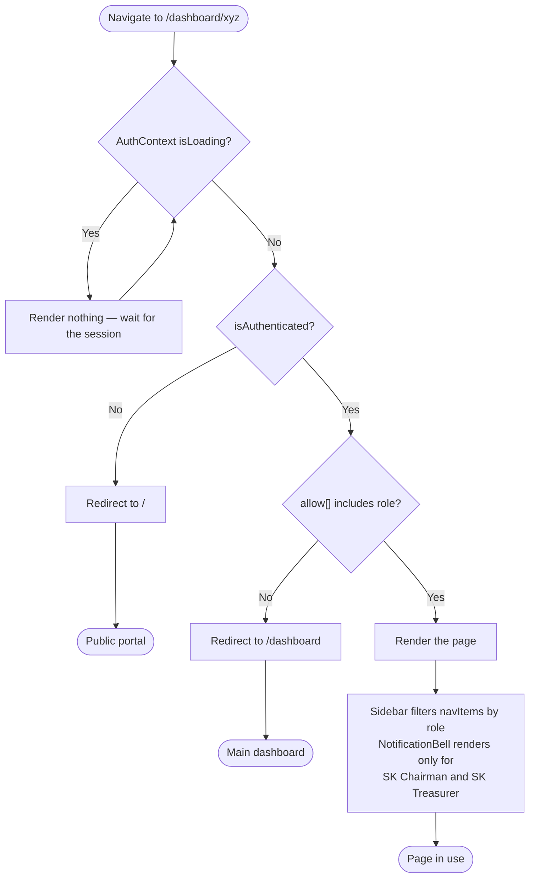
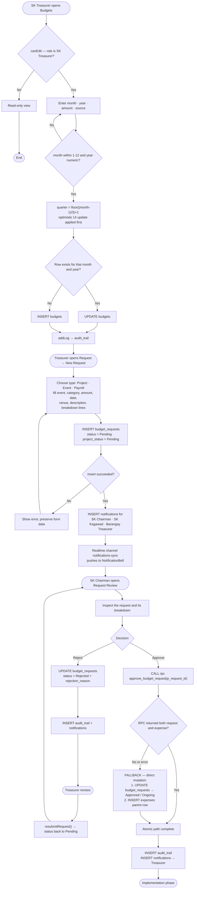
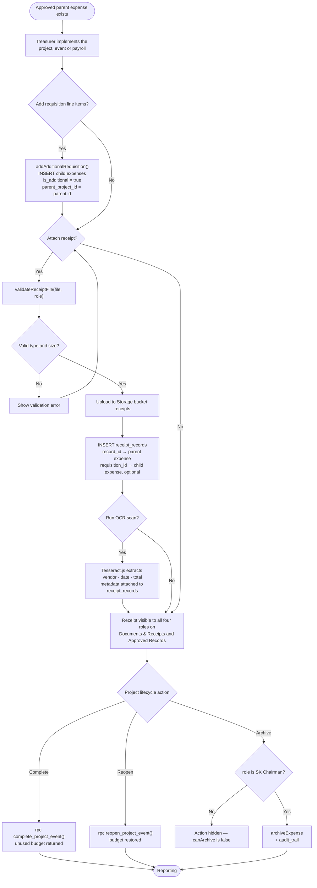
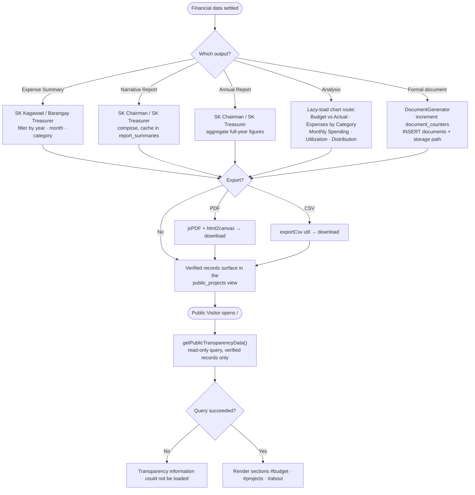
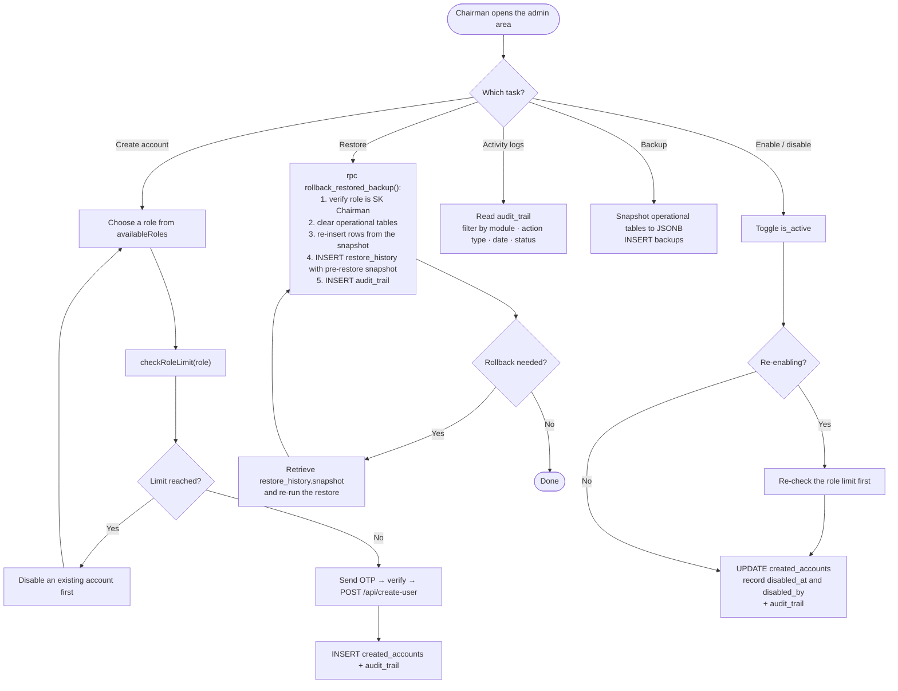

# Cuenta — Program Flow Documentation

> **Last updated:** September 2026  
> **Stack:** React (Vite) · Supabase (PostgreSQL + Auth + Storage) · Vercel

This document traces **runtime control flow** — the order in which the program
actually executes, branch by branch. It is the companion to
[SYSTEM_FLOW.md](SYSTEM_FLOW.md), which covers architecture and data movement.
Where that document answers *where the data lives*, this one answers
*what happens next*.

---

## Table of Contents

| Section | Flow |
|---|---|
| [A](#a-system-startup-flow) | System startup |
| [B](#b-authentication-flow) | Authentication — login and initial chairman setup |
| [C](#c-route-protection-flow) | Route protection |
| [D](#d-core-transaction-flow) | Core transaction — budget → request → approval |
| [E](#e-expense-documentation-flow) | Expense documentation and project lifecycle |
| [F](#f-reporting-analysis--publishing-flow) | Reporting, analysis and publishing |
| [G](#g-administration-flow) | Administration — chairman only |
| [H](#h-cross-cutting-flows) | Cross-cutting flows |
| [I](#i-drawing-this-as-a-program-flowchart) | Drawing this as a program flowchart |

---

## A. System Startup Flow

The entry point is [`src/main.jsx`](../src/main.jsx), which mounts the root and
loads the three stylesheets in a deliberate order — `system-components.css` is
last because it aliases the public portal's classes onto the internal component
names and has to win on equal specificity.

### Role resolution priority chain

`AuthContext` does not trust a single source for the user's role. It resolves in
this order and stops at the first value found:

1. `session.user.app_metadata.role` — set server-side, authoritative
2. `session.user.user_metadata.role`
3. `created_accounts` row matched by **user id**
4. `created_accounts` row matched by **email**, ordered `is_active` descending
   and capped at one row — a disabled account can share an email with a newer
   active one, so the active row has to win
5. Fallback: `'SK Chairman'`

Once resolved, the role and name are written back to `user_metadata` when they
differ, so JWT-backed RLS policies stay current.

---

## B. Authentication Flow

Two modes share one page: normal sign-in, and a one-time initial setup that
registers the SK Chairman. The setup form is hidden once a chairman exists.

**Note:** sign-in is email + password + reCAPTCHA only. There is **no OTP step on
login**. OTP is used for chairman registration, officer-account creation, and
email changes.

The disabled-account check runs *after* a successful password sign-in and signs
the user straight back out, so no session token is left active on a disabled
account.

---

## C. Route Protection Flow

`RoleGate` wraps every protected page and runs on each navigation.

Protection is layered: the sidebar hides what a role cannot reach, `RoleGate`
blocks direct URL entry, and Row Level Security refuses the query even if both
front-end checks were bypassed.

### Role to page access matrix

| Page | Chairman | Treasurer | Kagawad | Brgy. Treasurer |
|---|:--:|:--:|:--:|:--:|
| Main Dashboard | ✔ | ✔ | ✔ | ✔ |
| Budgets & Analysis | ✔ | ✔ (edit) | ✔ | ✔ |
| Approved Records | ✔ | ✔ | ✔ | ✔ |
| Documents & Receipts | ✔ | ✔ | ✔ | ✔ |
| Expenses | ✔ | ✔ | — | — |
| Expense Summary | — | — | ✔ | ✔ |
| Request / New Request | — | ✔ | — | — |
| Request Review (approvals) | ✔ | — | — | — |
| Narrative / Annual Report | ✔ | ✔ | — | — |
| Activity Logs (view-only) | ✔ | ✔ | ✔ | ✔ |
| Backup & Restore | ✔ | — | — | — |
| User Management | ✔ | — | — | — |
| Profile | ✔ | ✔ | ✔ | ✔ |

Budget **editing** is narrower than budget viewing: `canEdit` is true only for
`SK Treasurer`.

---

## D. Core Transaction Flow

This is the main program loop — budget allocation through approval.

### Why approval has two paths

Approval has to update `budget_requests` and create the matching `expenses`
parent row together, or not at all. The `approve_budget_request` SECURITY
DEFINER stored procedure does both in one transaction. If the RPC errors or is
not deployed, the client logs a warning and falls back to running the two
mutations directly. The fallback is a deliberate availability trade-off: it keeps
approvals working on an environment where the migration has not been applied, at
the cost of atomicity.

---

## E. Expense Documentation Flow

### Parent and child expense rows

The `expenses` table holds two kinds of row:

| Row | `is_additional` | `parent_project_id` | Created by |
|---|---|---|---|
| Approved parent | `false` | `null` | Approval RPC or its fallback |
| Requisition child | `true` | parent row id | `addAdditionalRequisition()` |

Totals have to sum children against their parent's approved amount — never sum
the whole table flat, or approved allocations get double-counted alongside their
own line items.

---

## F. Reporting, Analysis & Publishing Flow

The analysis routes are lazy-loaded behind `Suspense` so their chart libraries do
not weigh down any other route. The legacy `ai-analysis` and `analysis` paths
redirect to `/dashboard/budgets?tab=analysis`, and `receipts` and `payroll`
redirect into the Documents and Projects & Events pages respectively — old
bookmarks keep working after those merges.

---

## G. Administration Flow

Every branch below is SK Chairman only, enforced by `RoleGate` and RLS.

### Active-account limits

Limits count **active** accounts only; disabling an account frees its slot.

| Role | Maximum active accounts |
|---|---|
| SK Chairman | 1, created through initial setup |
| SK Treasurer | 1 |
| Barangay Treasurer | 1 |
| SK Kagawad | 8 |

The limit is checked twice — before the OTP is sent, so no unnecessary email goes
out, and again before an account is re-enabled.

---

## H. Cross-cutting Flows

These run alongside every flow above rather than in sequence with them.

| Flow | Trigger | Path |
|---|---|---|
| **Audit logging** | Any significant write | `addLog()` → `INSERT audit_trail` (user_id, user_name, user_role, action, action_type, module, record_id, description, status) |
| **Notifications** | Request submitted, approved, rejected or cancelled | `INSERT notifications` → Supabase Realtime channel `notifications-sync` → NotificationBell |
| **AI assistant** | Authenticated user opens ChatWidget | `supabase.functions.invoke('chatbot')` → Gemini, with live database context |
| **Session change** | Token refresh, sign-out, or a change in another tab | `onAuthStateChange` → re-resolve role → re-render gated routes |
| **Error containment** | Any route throws during render | `RouteErrorBoundary` renders a fallback instead of blanking the app |
| **RLS enforcement** | Every database call | Policy checks `auth.jwt() → app_metadata.role`; denial returns Postgres error `42501` |

Failed logins are logged too — the audit trail records the attempt with
`status: 'Failed'` and the error message before the form error is shown.

---

## I. Drawing this as a program flowchart

For documentation that requires ANSI flowchart symbols rather than the diagrams
above:

| Symbol | Use for | Example from this document |
|---|---|---|
| Oval | Start / End | `User opens Cuenta`, `Session ends` |
| Parallelogram | Input / Output | `Enter email and password`, `Display dashboard` |
| Rectangle | Process | `Compute quarter`, `Insert expense row` |
| Diamond | Decision | `Credentials valid?`, `Role is SK Chairman?` |
| Cylinder | Data store | Supabase tables |
| Double-sided rectangle | Predefined process | `approve_budget_request()`, `complete_project_event()`, `rollback_restored_backup()` |
| Circle | Off-page connector | Links section A → B → D |

Draw one chart per lettered section — a single combined chart will not fit a page
legibly. Section **D** is the one to feature in the main body, since it is the
system's core loop; the others belong in an appendix.

---

*Figure: Cuenta — runtime control flow from application boot through
authentication, role gating, the budget-request-approval loop, expense
documentation, reporting, and administration.*
