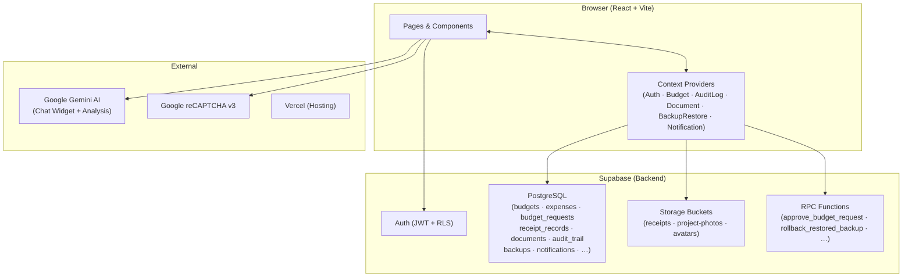
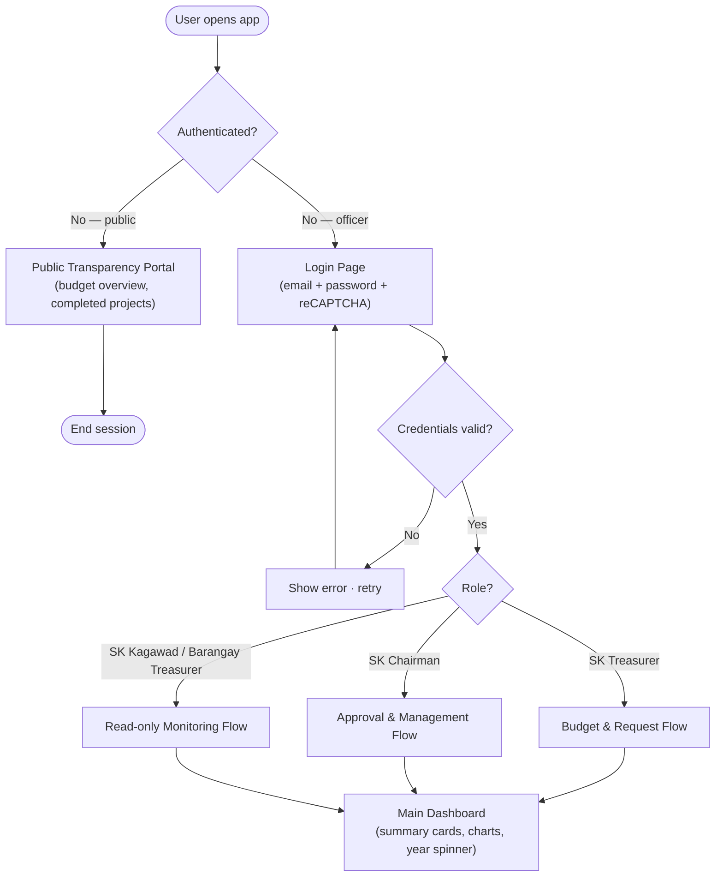
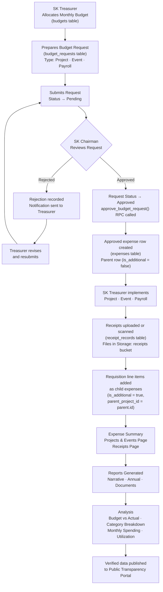
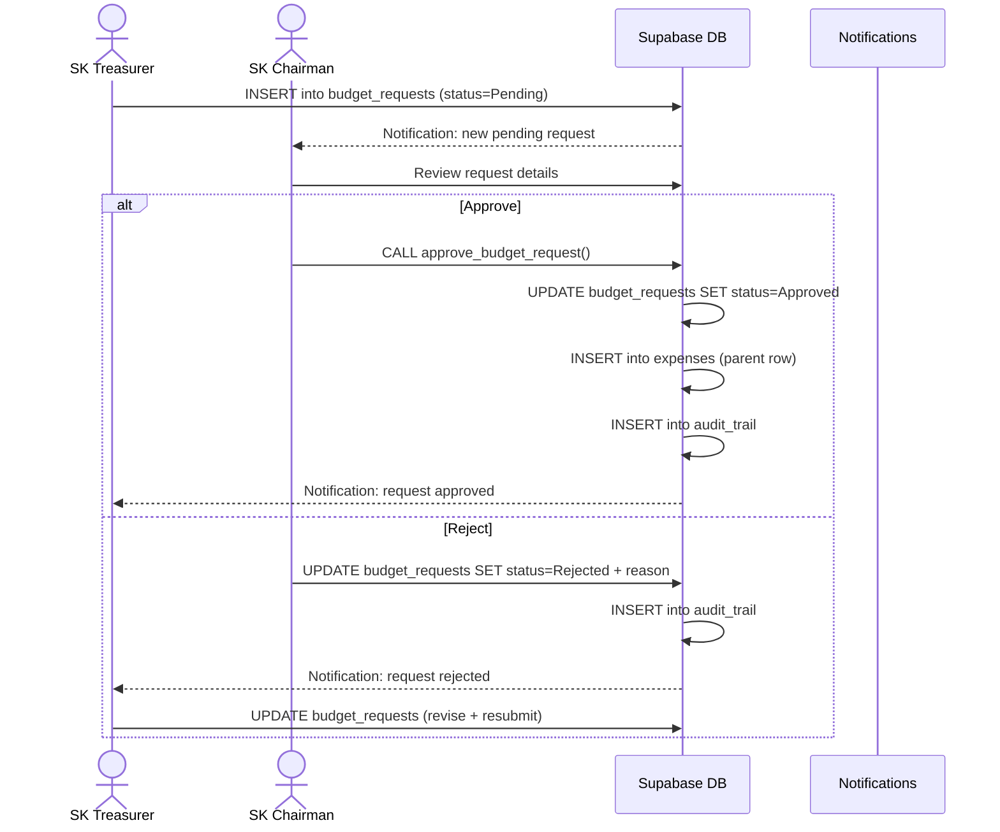
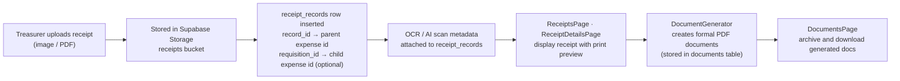
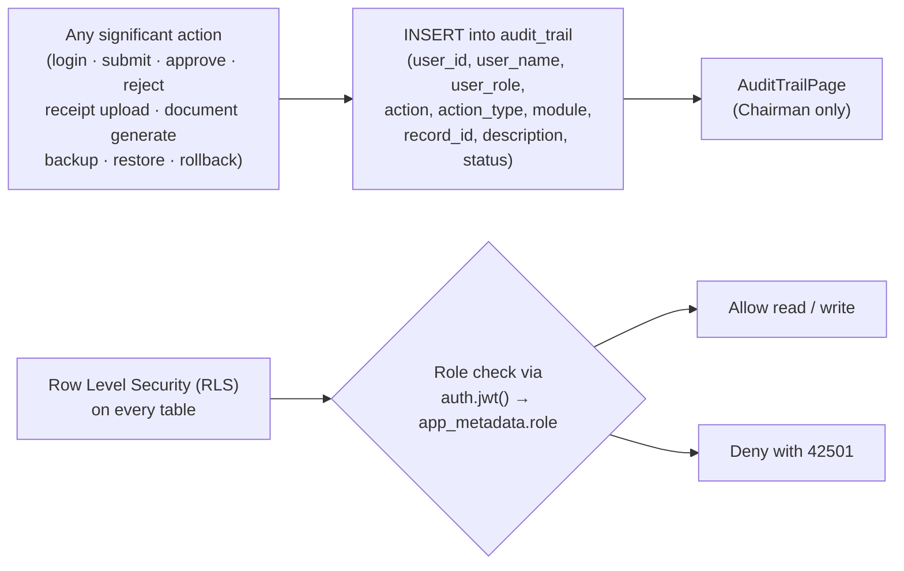
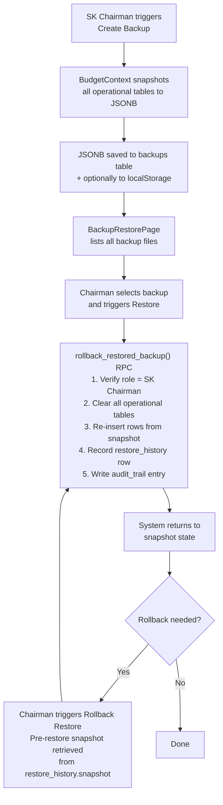

# Cuenta — System Flow Documentation

> **Last updated:** August 2026  
> **Stack:** React (Vite) · Supabase (PostgreSQL + Auth + Storage) · Vercel

---

## 1. System Overview

**Cuenta** is the financial management system of the *Sangguniang Kabataan* (SK). It covers the full lifecycle of public funds — from monthly budget allocation through request approval, expense documentation, receipt management, financial reporting, AI analysis, and public transparency publishing — with access strictly governed by user roles.

---

## 2. Architecture

---

## 3. User Roles & Access

| Role | Description | Key Permissions |
|---|---|---|
| **Public Visitor** | No account required | View public transparency portal only |
| **SK Chairman** | Highest authority | Full access — approvals, user management, audit trail, backup/restore |
| **SK Treasurer** | Financial officer | Budgets, requests, expenses, documents, receipts, reports |
| **SK Kagawad** | Council member | Read-only monitoring — requests, expenses, projects, receipts, summaries |
| **Barangay Treasurer** | External auditor | Read-only — approved financials, receipts, expense summaries, projects |

---

## 4. Application Routes

---

## 5. Main System Flow

---

## 6. Financial Transaction Flow

---

## 7. Request Approval Detail

---

## 8. Receipt & Document Flow

---

## 9. Database Tables

| Table | Purpose |
|---|---|
| `budgets` | Append-only monthly budget allocations (cumulative per month) |
| `budget_requests` | Project / Event / Payroll requests pending or approved by Chairman |
| `expenses` | Approved financial records; parent rows + requisition child rows |
| `projects` | Standalone project records (if separate from expenses) |
| `receipt_records` | Uploaded or scanned receipts linked to expense records |
| `project_photos` | Photo uploads attached to project records |
| `documents` | Generated financial documents (PDF metadata + storage path) |
| `document_counters` | Serial counter per document type / year |
| `report_summaries` | Cached narrative and annual report summaries |
| `audit_trail` | Immutable log of all significant user actions |
| `notifications` | In-app notifications dispatched to officers |
| `chat_history` | AI Chat Widget conversation history |
| `backups` | Backup file metadata (filename, created_at) |
| `restore_history` | Restore operation log including pre-restore snapshot (JSONB) |
| `profiles` | User profile data (name, avatar, contact) |
| `member_biodata` | SK member official biodata |
| `verification_codes` | Email OTP verification codes for account actions |

> ⚠️ **User tables** (`auth.users`, `profiles`, `member_biodata`, `verification_codes`) are **never** cleared by the data reset script.

---

## 10. Context Providers

| Provider | Responsibility |
|---|---|
| `AuthContext` | Supabase session, user role, sign-in / sign-out |
| `BudgetContext` | Budget allocations, expenses, requests, projects (main data store) |
| `AuditLogContext` | Writing to and reading from `audit_trail` |
| `DocumentContext` | Document generation, archiving, counter management |
| `BackupRestoreContext` | Full database backup to JSON, restore, and rollback via RPC |
| `NotificationContext` | Real-time in-app notifications via Supabase Realtime |

---

## 11. Analysis Module

The **Analysis** section (lazy-loaded) provides four chart views:

| Route | Chart | Description |
|---|---|---|
| `analysis/budget-vs-actual` | Bar / Line | Monthly allocated budget vs actual expenses |
| `analysis/expenses-by-category` | Doughnut / Pie | Spending breakdown by expense category |
| `analysis/monthly-spending` | Line | Spending trend across months in the selected year |
| `analysis/budget-utilization` | Gauge / Bar | Percentage of budget consumed per month |

An **AI Chat Widget** (powered by Google Gemini) is available to all authenticated officers for natural-language financial Q&A backed by live database context.

---

## 12. Public Transparency Portal

The root route `/` is publicly accessible without authentication. It displays:

- Current-year **budget overview** (total allocated vs spent)
- List of **completed projects** with actual expenditure figures
- Sections navigable via URL hash: `/#budget`, `/#projects`, `/#about`

Data is served through the `publicTransparencyService` using a restricted read-only Supabase query that only surfaces verified/approved records.

---

## 13. Audit & Security Model

- All tables have **RLS enabled**
- Role is stored in `app_metadata` (set server-side by Chairman on user creation)
- `SECURITY DEFINER` RPC functions (`approve_budget_request`, `rollback_restored_backup`) bypass RLS only for atomic operations after internal role validation

---

## 14. Backup & Restore Flow

---

## 15. Data Reset (Admin Only)

The [`reset_database_data.sql`](../supabase/migrations/reset_database_data.sql) script wipes all operational data while preserving all user accounts.

**Cleared:** budgets · budget_requests · expenses · projects · receipt_records · project_photos · documents · document_counters (reset to 0) · report_summaries · chat_history · audit_trail · restore_history · backups · notifications

**Preserved:** `auth.users` · `profiles` · `member_biodata` · `verification_codes`

---

*Figure: Cuenta Financial Management System — complete flow from public access through role-based officer workflows, financial lifecycle, reporting, and public transparency.*
