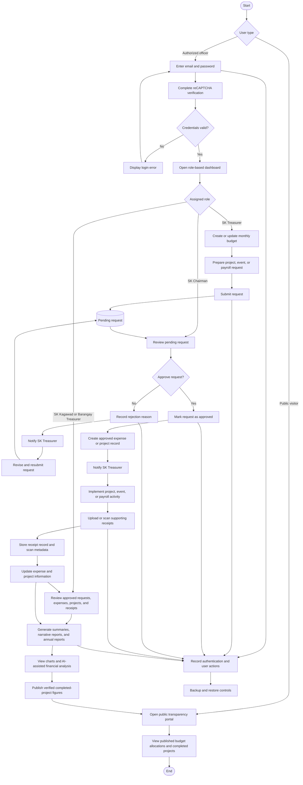
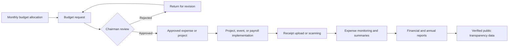

# Cuenta Financial Management System Flow

## System overview

Cuenta manages the financial activities of the Sangguniang Kabataan from budget preparation and request approval through expense documentation, reporting, auditing, and public disclosure. Access to internal functions is controlled according to the assigned user role.

## Main system flow

## Financial transaction flow

## Role responsibilities

| User role | Primary system responsibilities |
|---|---|
| Public visitor | View published budget allocations and completed-project information without an account. |
| SK Chairman | Manage users, approve or reject requests, review audit records, manage backups, and access reports and analysis. |
| SK Treasurer | Maintain monthly budgets, prepare and submit project, event, and payroll requests, manage financial documents, receipts, and reports. |
| SK Kagawad | Monitor approved requests, projects, expenses, receipts, summaries, and available financial analysis. |
| Barangay Treasurer | Review approved financial activity, supporting receipts, expense summaries, projects, and available financial analysis. |

## Data and control flow

1. An authorized officer signs in, and the system validates the credentials through Supabase Authentication.
2. Role-based access control determines which pages and actions the authenticated officer may use.
3. The SK Treasurer records monthly budgets and submits a budget request with its category, amount, date, venue, description, and itemized breakdown.
4. The request remains pending until the SK Chairman reviews it.
5. A rejected request is returned with a reason and may be revised and resubmitted.
6. Approval updates the request and creates the corresponding approved expense or project record.
7. Supporting receipts are uploaded or scanned and linked to the approved transaction.
8. Approved financial records feed the dashboards, summaries, charts, analysis, narrative reports, and annual reports.
9. Verified completed-project information is published to the public transparency portal.
10. Significant actions are recorded in the audit trail, while backup and restore functions protect system records.

## Suggested figure caption

**Figure: Cuenta Financial Management System Flow.** The diagram shows how authenticated SK officers prepare budgets, submit and approve requests, document expenses, generate reports, and publish verified financial information for public transparency.
